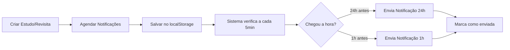

# 🔔 Sistema de Notificações Inteligentes do Mynis

## 📋 Visão Geral

O Mynis agora possui um **sistema inteligente de notificações** que envia lembretes automáticos 24h e 1h antes dos eventos agendados (estudos bíblicos e revisitas), garantindo que você nunca esqueça de seus compromissos espirituais.

---

## ✨ Funcionalidades Principais

### 1. Notificações Duplas
- **24h antes**: Lembrete para se preparar para o evento
- **1h antes**: Lembrete final para não esquecer

### 2. Tipos de Eventos Suportados
- 📚 **Estudos Bíblicos** - Lembretes de estudos agendados
- 🏠 **Revisitas** - Lembretes de visitas agendadas
- 🏛️ **Reuniões** - Suporte futuro para reuniões

### 3. Notificações Nativas
- Usa a **Web Notifications API** do navegador
- Notificações aparecem mesmo com o app fechado
- Som e vibração (em dispositivos compatíveis)
- Notificações persistentes (não somem automaticamente)

### 4. Verificação Inteligente
- Sistema verifica eventos a cada **5 minutos**
- Janela de tolerância de **10 minutos** para 24h
- Janela de tolerância de **5 minutos** para 1h
- Limpeza automática de notificações antigas

---

## 🎯 Como Funciona

### Fluxo de Agendamento



### Exemplo Prático

**Cenário**: Estudo com João Silva agendado para **15/01/2025 às 14:00**

1. **14/01/2025 às 14:00** ➜ 🗓️ Notificação: "Lembrete: Estudo com João Silva - Amanhã às 14:00. Prepare-se!"
2. **15/01/2025 às 13:00** ➜ ⏰ Notificação: "Em 1 hora: Estudo com João Silva - Às 14:00. Está preparado?"

---

## 🛠️ Arquitetura Técnica

### Componentes Principais

#### 1. `SmartNotificationManager` (`/utils/notifications/smartNotifications.ts`)

**Classe principal** que gerencia todo o sistema:

```typescript
class SmartNotificationManager {
  // Permissões
  static async requestPermission(): Promise<boolean>
  static hasPermission(): boolean
  
  // Agendamento
  static scheduleEstudoNotification(estudoId, nome, data, horario, endereco)
  static scheduleRevisitaNotification(revisitaId, nome, data, horario, endereco)
  
  // Gerenciamento
  static checkAndSendNotifications()
  static cleanOldSchedules()
  static removeSchedulesByEntity(entityId)
  
  // Informações
  static getAllSchedules(): NotificationSchedule[]
  static getUpcomingNotifications(): NotificationSchedule[]
  static getStats()
  
  // Ciclo de Vida
  static initialize()
  static stop()
  static testNotification()
}
```

#### 2. Interface `NotificationSchedule`

```typescript
interface NotificationSchedule {
  id: string;
  type: 'estudo' | 'revisita' | 'reuniao' | 'outro';
  title: string;
  description: string;
  eventDate: string; // ISO date
  eventTime: string; // HH:mm
  sent24h: boolean;  // Se já enviou notif 24h
  sent1h: boolean;   // Se já enviou notif 1h
  metadata?: {
    estudoId?: string;
    revisitaId?: string;
    nomeEstudante?: string;
    endereco?: string;
  };
}
```

### Persistência de Dados

Todas as notificações agendadas são salvas no **localStorage**:

```typescript
// Chave: 'mynis_notification_schedules'
// Valor: NotificationSchedule[]
[
  {
    id: "estudo_abc123_1234567890",
    type: "estudo",
    title: "Estudo com João Silva",
    description: "Hoje às 14:00 em Rua das Flores, 123",
    eventDate: "2025-01-15",
    eventTime: "14:00",
    sent24h: false,
    sent1h: false,
    metadata: {
      estudoId: "abc123",
      nomeEstudante: "João Silva",
      endereco: "Rua das Flores, 123"
    }
  }
]
```

---

## 🔧 Integração com Formulários

### Formulário de Estudo (`FormularioEstudo.tsx`)

```typescript
// Ao salvar novo estudo
const estudoCriado = DataService.adicionarEstudo(novoEstudo);

SmartNotificationManager.scheduleEstudoNotification(
  estudoCriado.id,
  formData.estudanteNome,
  formData.data,
  formData.horario,
  formData.endereco
);

// Ao editar estudo
SmartNotificationManager.removeSchedulesByEntity(estudo.id);
SmartNotificationManager.scheduleEstudoNotification(/* ... */);

// Ao deletar estudo
SmartNotificationManager.removeSchedulesByEntity(estudo.id);
```

### Página de Registro de Visita (`RegistrarVisitaPage.tsx`)

```typescript
// Ao registrar visita com próxima visita agendada
if (formData.proximaVisita && formData.horarioProximaVisita) {
  SmartNotificationManager.scheduleRevisitaNotification(
    revisita.id,
    revisita.nome,
    formData.proximaVisita,
    formData.horarioProximaVisita,
    revisita.endereco
  );
}
```

---

## 🎨 Interface do Usuário

### Card de Notificações Inteligentes (PerfilTab)

Localizado na aba **Perfil**, o card colapsável mostra:

1. **Status atual**
   - Ativo/Inativo
   - Botão para ativar/testar

2. **Estatísticas**
   - Total de notificações agendadas
   - Notificações pendentes
   - Notificações enviadas (24h e 1h)
   - Distribuição por tipo

3. **Próximas Notificações (48h)**
   - Lista dos próximos eventos
   - Horário formatado (Hoje, Amanhã, DD/MM)
   - Badges indicando lembretes pendentes
   - Endereço (se disponível)

4. **Informações**
   - Como funciona o sistema
   - Horários de verificação
   - Comportamento das notificações

---

## 📱 Componente NotificationSettings

**Arquivo**: `/components/shared/NotificationSettings.tsx`

### Recursos

```typescript
export default function NotificationSettings() {
  // Estado
  const [hasPermission, setHasPermission] = useState(false);
  const [stats, setStats] = useState({});
  const [upcomingNotifications, setUpcomingNotifications] = useState([]);

  // Ações
  const handleActivate = async () => { /* Solicita permissão */ }
  const handleTest = async () => { /* Testa notificação */ }
  
  // Helpers
  const formatDateTime = (date, time) => { /* "Hoje às 14:00" */ }
  const getTypeIcon = (type) => { /* 📚, 🏠, etc */ }
  const getTypeLabel = (type) => { /* "Estudo", "Revisita" */ }
}
```

### Layout

1. **Status Card**
   - Ícone de sino (ativo/inativo)
   - Texto explicativo
   - Badge de status
   - Botão de ação principal

2. **Estatísticas Card**
   - Grid 2x2 com métricas
   - Lista de tipos de eventos
   - Estilo visual consistente

3. **Próximas Notificações Card**
   - Lista scrollável
   - Cards individuais por evento
   - Badges de status (24h/1h pendente)
   - Informações completas

4. **Info Card**
   - Explicação do funcionamento
   - Dicas de uso
   - Estilo azul informativo

---

## 🔐 Permissões

### Solicitação de Permissão

```typescript
// Ao ativar notificações
const granted = await SmartNotificationManager.requestPermission();

if (granted) {
  toast.success('Notificações ativadas! 🔔');
} else {
  toast.info('Notificações desativadas');
}
```

### Estados de Permissão

| Estado | Descrição |
|--------|-----------|
| `granted` | Usuário permitiu notificações |
| `denied` | Usuário negou notificações |
| `default` | Usuário ainda não decidiu |

### Verificação de Suporte

```typescript
if (!('Notification' in window)) {
  console.log('Notificações não suportadas');
  return false;
}
```

---

## 📊 Estatísticas e Monitoramento

### Método `getStats()`

Retorna estatísticas completas:

```typescript
{
  total: 5,           // Total de notificações agendadas
  pending: 3,         // Notificações pendentes (24h ou 1h)
  sent24h: 2,         // Notificações 24h enviadas
  sent1h: 1,          // Notificações 1h enviadas
  byType: {
    estudo: 3,        // 3 estudos agendados
    revisita: 2       // 2 revisitas agendadas
  }
}
```

### Método `getUpcomingNotifications()`

Retorna próximas notificações (48h):

```typescript
[
  {
    id: "estudo_abc_123",
    type: "estudo",
    title: "Estudo com João Silva",
    eventDate: "2025-01-15",
    eventTime: "14:00",
    sent24h: false,
    sent1h: false,
    metadata: { /* ... */ }
  }
]
```

---

## ⏰ Sistema de Verificação

### Intervalos de Verificação

```typescript
const CHECK_INTERVAL = 5 * 60 * 1000; // 5 minutos

setInterval(() => {
  SmartNotificationManager.checkAndSendNotifications();
  SmartNotificationManager.cleanOldSchedules();
}, CHECK_INTERVAL);
```

### Janelas de Tempo

**24h antes:**
```typescript
// Janela: entre 24h e 23h50min antes
const is24hWindow = timeDiff <= 86400000 && timeDiff >= 85800000;
```

**1h antes:**
```typescript
// Janela: entre 1h e 55min antes
const is1hWindow = timeDiff <= 3600000 && timeDiff >= 3300000;
```

### Limpeza Automática

Remove notificações de eventos que já passaram:

```typescript
static cleanOldSchedules(): void {
  const schedules = this.getAllSchedules();
  const now = new Date();
  
  const active = schedules.filter(schedule => {
    const eventDateTime = this.getEventDateTime(schedule);
    return eventDateTime > now;
  });

  if (active.length !== schedules.length) {
    this.saveSchedules(active);
    console.log(`🧹 Limpou ${schedules.length - active.length} notificações antigas`);
  }
}
```

---

## 🧪 Teste de Notificações

### Método `testNotification()`

```typescript
static async testNotification(): Promise<void> {
  const hasPermission = await this.requestPermission();
  
  if (!hasPermission) {
    toast.error('Permissão negada');
    return;
  }

  this.sendNativeNotification(
    '🎉 Notificações funcionando!',
    'Você receberá lembretes de estudos e revisitas',
    undefined
  );

  toast.success('Teste de notificação enviado! 🔔');
}
```

### Como Testar

1. Ir para **Perfil** → **Notificações Inteligentes**
2. Expandir o card
3. Clicar em **"Ativar Notificações"** (se necessário)
4. Clicar em **"Testar Notificação"**
5. Verificar se a notificação apareceu no sistema

---

## 📈 Fluxo Completo de Uso

### 1. Primeira Ativação

```
Usuário → Perfil → Notificações Inteligentes
  → Clicar "Ativar Notificações"
  → Navegador solicita permissão
  → Usuário aceita
  → Toast: "Notificações ativadas! 🔔"
  → Sistema inicia verificações
```

### 2. Criar Estudo com Notificações

```
Usuário → Estudos → Novo Estudo
  → Preencher dados
  → Definir data e horário
  → Salvar
  → Sistema agenda notificações automáticas
  → Toast: "Lembretes agendados 🔔"
```

### 3. Receber Notificações

```
Sistema → Verifica a cada 5min
  → Encontra evento 24h antes
  → Envia notificação: "🗓️ Lembrete: Estudo com João Silva - Amanhã às 14:00"
  → Marca sent24h = true

  → 1h antes do evento
  → Envia notificação: "⏰ Em 1 hora: Estudo com João Silva - Às 14:00"
  → Marca sent1h = true
```

### 4. Verificar Próximas Notificações

```
Usuário → Perfil → Notificações Inteligentes
  → Expandir card
  → Ver "Próximas Notificações (48h)"
  → Lista com todos os eventos agendados
  → Badges indicando status
```

---

## 🎯 Benefícios

### Para o Usuário

1. **Nunca esquecer** compromissos espirituais
2. **Tempo para se preparar** (24h antes)
3. **Lembrete final** (1h antes)
4. **Visualização clara** dos próximos eventos
5. **Estatísticas** de notificações

### Para o Sistema

1. **Automático**: sem intervenção manual
2. **Inteligente**: janelas de tempo precisas
3. **Eficiente**: verificação a cada 5min
4. **Robusto**: limpeza automática de dados antigos
5. **Persistente**: sobrevive a reinicializações

---

## 🔮 Futuras Melhorias

### v4.1+

- [ ] Notificações para reuniões
- [ ] Personalização de horários (30min, 2h, etc)
- [ ] Repetição de lembretes
- [ ] Snooze de notificações
- [ ] Sons personalizados
- [ ] Notificações de progresso de metas
- [ ] Lembretes de leitura bíblica
- [ ] Notificações de aniversário de batismo

---

## 📚 Referências

- [Web Notifications API](https://developer.mozilla.org/en-US/docs/Web/API/Notifications_API)
- [Notification.requestPermission()](https://developer.mozilla.org/en-US/docs/Web/API/Notification/requestPermission)
- [Service Workers](https://developer.mozilla.org/en-US/docs/Web/API/Service_Worker_API)

---

## 🙏 Agradecimentos

Sistema desenvolvido para ajudar publicadores a organizarem melhor seu ministério, garantindo que nenhum compromisso espiritual seja esquecido.

**Mynis v4.0** - Sistema de Notificações Inteligentes | Novembro 2025
